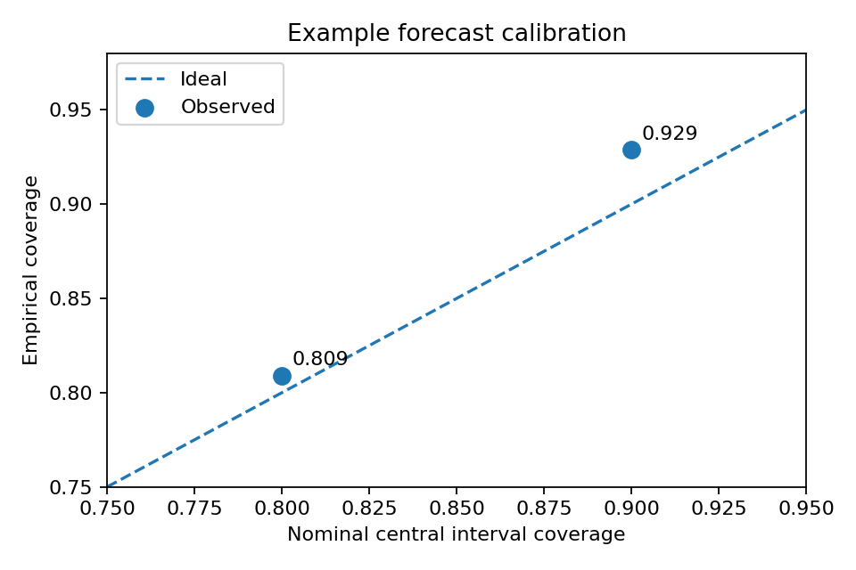
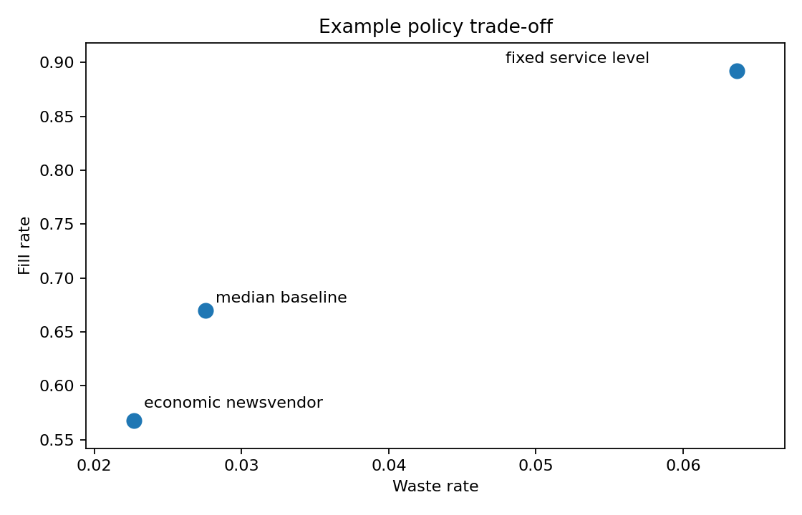

# Perishable Inventory Decision Lab

[](https://github.com/DiogoRibeiro7/perishable-inventory-decision-lab/actions/workflows/ci.yml)
[](https://doi.org/10.5281/zenodo.21494115)
[](pyproject.toml)
[](LICENSE)
[](https://github.com/DiogoRibeiro7/perishable-inventory-decision-lab/releases)

A production-oriented Python project for **probabilistic demand forecasting, perishable inventory simulation, and replenishment policy evaluation**.

Fresh-food ordering is a decision problem under uncertainty. A store can lose sales by under-ordering, create waste by over-ordering, or make a good forecast unusable by ignoring shelf life, lead time, supplier constraints, and noisy stock records. This repository models that full decision loop rather than stopping at a forecasting notebook.

For a portfolio-style technical narrative, see [`docs/PORTFOLIO_CASE_STUDY.md`](docs/PORTFOLIO_CASE_STUDY.md). The case study explains the modelling choices, failure modes, production controls, and first 90 days of retailer validation without treating synthetic results as commercial impact.

## What It Does

For each `date x store_id x product_id`, the system:

1. Validates source data and maps product identifiers into a stable daily contract.
2. Builds leakage-safe lag, rolling, calendar, price, promotion, and inventory features.
3. Fits quantile demand forecasts and calibrates forecast intervals.
4. Converts forecast distributions into order quantities.
5. Simulates FIFO perishable inventory with expiry, shrinkage, lead time, stock-record noise, supplier fill rate, and order constraints.
6. Compares policies on fill rate, waste, lost sales, inventory, and total operating cost.
7. Writes versioned run artifacts, monitoring status, and an evaluation report.

## Why This Project Exists

Most demand-forecasting demos optimise a statistical score. Real replenishment systems need to optimise a business decision:

\[
C = c_w \cdot \text{waste} + c_s \cdot \text{lost sales} + c_h \cdot \text{ending inventory}
\]

The right forecast is not necessarily the forecast with the lowest average error. It is the forecast and policy combination that preserves availability while controlling waste and operating cost.

## Quickstart

Requirements: Python 3.11 or 3.12 and Poetry.

```bash
poetry install
poetry run perishable-lab demo --output-dir artifacts/demo
```

Run the quality gate:

```bash
poetry run ruff check .
poetry run mypy src
poetry run pytest
```

The demo is deterministic for a fixed seed and runs end to end without cloud credentials.

## Citation

Citation metadata is included in [`CITATION.cff`](CITATION.cff) and Zenodo metadata is included in [`.zenodo.json`](.zenodo.json). Cite all versions with DOI [`10.5281/zenodo.21494115`](https://doi.org/10.5281/zenodo.21494115).

## Community

Participation in this repository is covered by the [Code of Conduct](CODE_OF_CONDUCT.md). Contribution, support, and security guidance are available in [CONTRIBUTING.md](CONTRIBUTING.md), [SUPPORT.md](SUPPORT.md), and [SECURITY.md](SECURITY.md).

## Demo Outputs

```text
artifacts/demo/
├── synthetic_daily_demand.csv
├── forecast_predictions.csv
├── forecast_metrics.json
├── inventory_daily_median_baseline.csv
├── inventory_daily_fixed_service_level.csv
├── inventory_daily_economic_newsvendor.csv
├── policy_metrics.csv
├── monitoring_report.json
├── evaluation_report.json
└── run_manifest.json
```

Every persisted forecast and policy output includes run metadata such as generation time, configuration hash, model version, and policy version.

## Example Result

Committed example artifacts are available in [`reports/example_run`](reports/example_run), with interpretation in [`reports/example_results.md`](reports/example_results.md).

| Policy | Fill rate | Waste rate | Cost per demand unit |
|---|---:|---:|---:|
| fixed service level | 0.892 | 0.064 | 0.381 |
| median baseline | 0.670 | 0.028 | 0.580 |
| economic newsvendor | 0.568 | 0.023 | 0.666 |

In this synthetic run, the fixed service-level policy wins because the availability gain outweighs the extra inventory and waste. The economic critical-fractile policy under-orders under the configured cost assumptions, which is a useful diagnostic rather than a result to hide.





## Repository Map

```text
src/perishable_lab/
├── data/          # Source contracts, local/cloud adapters, synthetic data, validation
├── forecasting/   # Quantile models, calibration, lead-time baselines, fallback forecasts
├── inventory/     # Perishable simulator and replenishment policies
├── evaluation/    # Temporal splits, reporting, paired resampling
├── monitoring/    # Data, forecast, and decision health checks
├── deployment/    # GCP helper utilities for idempotent batch execution
├── pipelines/     # End-to-end demo workflow
└── cli.py         # Command-line entry point

airflow/           # Example orchestration DAG
dbt_project/       # Example BigQuery/dbt transformations and tests
gcp/               # Cloud Build, Cloud Run Job pattern, deployment runbook
docs/              # Architecture, modelling choices, experiment plan, walkthroughs
reports/           # Committed example metrics and figures
tests/             # Unit and integration tests
```

## Core Components

**Data contracts:** Typed source contracts cover sales, stock snapshots, waste events, deliveries, orders, product master, supplier mappings, promotions, prices, and calendars. The canonical builder deduplicates versioned records, respects effective-dated product mappings, and filters price/promotion inputs to values known by the decision cut-off.

**Forecasting:** The baseline model fits one scikit-learn gradient-boosting regressor per quantile. Predictions are constrained to be non-negative and monotone. The package also includes seasonal empirical fallback forecasts, an intermittent-demand baseline, lead-time cumulative quantile utilities, and model serialization.

**Inventory simulation:** The simulator represents inventory as FIFO shelf-life cohorts with pending deliveries, expiry, shrinkage, lost sales, noisy observed inventory, supplier fill rate, lead-time jitter, capacity, minimum order quantities, and case packs.

**Ordering policies:** Included policies cover a median baseline, fixed service-level base-stock rule, economic newsvendor target, constrained base-stock rule, age-aware heuristic, and a clairvoyant lower bound for regret analysis only.

**Evaluation and monitoring:** Forecast metrics and policy metrics are intentionally separate. The pipeline reports pinball loss, interval coverage, interval width, approximate CRPS, fill rate, waste rate, lost-sales rate, total cost, and monitoring alerts.

## Experiment Examples

```bash
# Larger simulation
poetry run perishable-lab demo \
  --days 365 \
  --stores 8 \
  --products 30 \
  --seed 42 \
  --output-dir artifacts/year_run

# Compare different service targets
poetry run perishable-lab demo --service-level 0.80 --output-dir artifacts/sl80
poetry run perishable-lab demo --service-level 0.95 --output-dir artifacts/sl95
```

## Production Pattern

The repository is local-first, but includes deployable patterns for:

- BigQuery-backed raw, staging, feature, forecast, recommendation, and outcome tables.
- dbt source checks and incremental transformations.
- Cloud Run Jobs for batch scoring, simulation, and monitoring.
- Airflow orchestration with validation gates before recommendation publication.
- Idempotent partition publication and deterministic execution IDs.
- Immutable run manifests and model/policy version fields.

See [`gcp/DEPLOYMENT_RUNBOOK.md`](gcp/DEPLOYMENT_RUNBOOK.md) for the deployment workflow and rollback pattern.

## Roadmap

The detailed path from the current `0.1.0` release to a stable `1.0.0` decision-system release is maintained in [`docs/DELIVERY_ROADMAP.md`](docs/DELIVERY_ROADMAP.md). It defines planned versions, acceptance gates, migration notes, rollback paths, and release blockers.

## Current Limitations

This is a decision-system prototype, not proof of commercial lift. The synthetic generator is useful for controlled stress tests, but real retailer deployment would require:

- Explicit stockout-censoring correction, because observed sales are not always latent demand.
- Segmented calibration by demand volume, promotion, shelf life, store, and product.
- Stable persisted encodings for store and product identifiers.
- Event-order validation against the retailer's actual operating process.
- Policy selection with global and segment-level service constraints.

See [`docs/READINESS_REVIEW.md`](docs/READINESS_REVIEW.md) for a technical risk review, and [`docs/INTERVIEW_WALKTHROUGH.md`](docs/INTERVIEW_WALKTHROUGH.md) for a presentation guide.
