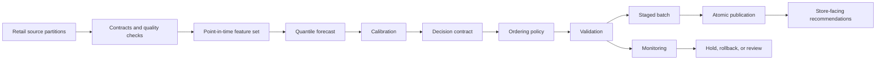
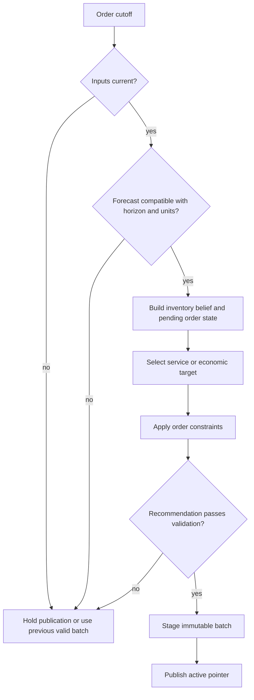
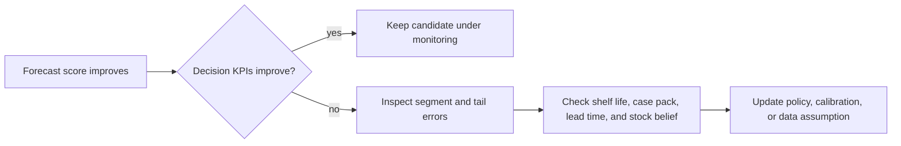

# Architecture And Decision Flow Diagrams

## Architecture

```mermaid
flowchart LR
    A[Retail source partitions] --> B[Contracts and quality checks]
    B --> C[Point-in-time feature set]
    C --> D[Quantile forecast]
    D --> E[Calibration]
    E --> F[Decision contract]
    F --> G[Ordering policy]
    G --> H[Validation]
    H --> I[Staged batch]
    I --> J[Atomic publication]
    J --> K[Store-facing recommendations]
    H --> L[Monitoring]
    L --> M[Hold, rollback, or review]
```

## Decision Flow

```mermaid
flowchart TD
    A[Order cutoff] --> B{Inputs current?}
    B -- no --> C[Hold publication or use previous valid batch]
    B -- yes --> D{Forecast compatible with horizon and units?}
    D -- no --> C
    D -- yes --> E[Build inventory belief and pending order state]
    E --> F[Select service or economic target]
    F --> G[Apply order constraints]
    G --> H{Recommendation passes validation?}
    H -- no --> C
    H -- yes --> I[Stage immutable batch]
    I --> J[Publish active pointer]
```

## Failure Analysis Flow

```mermaid
flowchart LR
    A[Forecast score improves] --> B{Decision KPIs improve?}
    B -- yes --> C[Keep candidate under monitoring]
    B -- no --> D[Inspect segment and tail errors]
    D --> E[Check shelf life, case pack, lead time, and stock belief]
    E --> F[Update policy, calibration, or data assumption]
```
