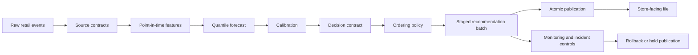

# Portfolio Case Study: Perishable Inventory Decision Lab

## 1. Problem

Fresh-food ordering is not just a demand-forecasting problem. A store can lose availability by ordering too little, create waste by ordering too much, or make a statistically strong forecast unusable by ignoring shelf life, delivery timing, supplier constraints, and noisy stock records. The project therefore treats forecasting as one input to a decision system rather than the final product. Evidence: `README.md`, `docs/ARCHITECTURE.md`, `tests/test_inventory.py`.

Point forecasts are insufficient because a replenishment decision is shaped by the tails of demand, the age of stock, and the cost of being wrong in each direction. The repository uses quantile forecasts and policy simulation so the order quantity can be evaluated against availability, waste, lost sales, and total cost. Evidence: `src/perishable_lab/forecasting/quantile.py`, `src/perishable_lab/inventory/simulator.py`, `reports/example_run/policy_metrics.csv`.

## 2. Data Challenges

The data layer is designed around failure modes that are common in grocery operations:

- Product identity changes can split or merge history incorrectly. Evidence: `src/perishable_lab/product_identity/resolution.py`, `tests/test_product_identity.py`, `docs/HIERARCHICAL_FORECASTING.md`.
- Observed sales can be censored when the product is out of stock. Evidence: `src/perishable_lab/demand_censoring/strategies.py`, `tests/test_demand_censoring.py`, `docs/LATENT_DEMAND_CARD.md`.
- Inventory records can be stale or wrong relative to the order cutoff. Evidence: `src/perishable_lab/inventory/reconciliation.py`, `tests/test_inventory_reconciliation.py`, `docs/INVENTORY_BELIEF.md`.
- Shelf life and expiry risk change the value of a unit already on hand. Evidence: `src/perishable_lab/shelf_life/models.py`, `tests/test_shelf_life.py`, `docs/SHELF_LIFE_MODEL_CARD.md`.
- Supplier lead time and fill rate can invalidate a recommendation after the forecast is produced. Evidence: `src/perishable_lab/supplier.py`, `tests/test_supplier.py`, `docs/SUPPLIER_RELIABILITY.md`.

These are represented as explicit contracts or uncertainty inputs. The goal is not to claim that the synthetic data contains every retailer edge case, but to make the system surface where real data would need stronger measurement.

## 3. Decision Formulation

The replenishment decision balances waste and availability under hard constraints. The simplified operating cost used in the demo combines waste, lost sales, and holding cost:

```text
cost = waste cost + lost-sales cost + holding cost
```

The policy layer receives a compatible forecast distribution, inventory belief, pending orders, review period, lead time, shelf life, cost parameters, and ordering constraints. It rejects stale inventory, unit mismatches, duplicate pending orders, and invalid horizon semantics. Evidence: `src/perishable_lab/decision.py`, `tests/test_decision.py`, `docs/FORECAST_DECISION_CONTRACT.md`.

Rejected alternative: selecting a model only by pinball loss. That would hide the fact that a modest statistical improvement can be concentrated in low-risk rows, while errors in high-margin, short-shelf-life, or constrained products can make ordering worse. The evaluation layer therefore keeps forecast metrics and policy metrics separate. Evidence: `docs/ARCHITECTURE.md`, `src/perishable_lab/evaluation/reporting.py`, `reports/example_results.md`.

## 4. Architecture And Information Flow



The system is local-first but includes production patterns for BigQuery, dbt, Airflow, Cloud Run Jobs, immutable artifacts, idempotent job identifiers, and rollback. Evidence: `dbt_project/models/schema.yml`, `airflow/dags/perishable_lab_daily.py`, `gcp/DEPLOYMENT_RUNBOOK.md`, `src/perishable_lab/publication.py`.

## 5. Forecasting And Calibration

The default forecaster fits one gradient-boosting regressor per quantile and enforces non-negative, monotone quantile output. Calibration uses a separated calibration period and applies a conformal adjustment before evaluation on the untouched test period. Evidence: `src/perishable_lab/forecasting/quantile.py`, `src/perishable_lab/forecasting/conformal.py`, `tests/test_conformal.py`, `reports/example_run/forecast_metrics.json`.

Calibration is not treated as a global checkbox. Segment-level degradation is tracked in reporting and dashboard specifications because a global metric can hide harms to stores, products, shelf-life groups, or promoted items. Evidence: `docs/DASHBOARD_METRIC_DICTIONARY.md`, `tests/test_dashboard.py`, `reports/example_run/coverage_summary.csv`.

## 6. Inventory State, Simulator, And Verification

The simulator stores inventory as FIFO shelf-life cohorts with pending deliveries. Each day ages and expires stock, receives due deliveries, applies shrinkage, fulfils demand, observes noisy inventory, requests an order, applies constraints, and schedules future arrivals. Evidence: `src/perishable_lab/inventory/simulator.py`, `docs/SIMULATOR_CARD.md`.

Verification focuses on invariants: demand conservation, non-negative inventory, supplier fill not exceeding order quantity, reproducible replay, and a hand-solvable golden scenario. Evidence: `tests/test_simulator_vv.py`, `tests/test_properties.py`, `tests/fixtures/golden_simulation_expected.csv`, `artifacts/simulator_vv/validation_gate.json`.

Limitation: the simulator is validated as software, not as a full replica of retailer operations. Real deployment would require event-order checks against store processes and calibration from retailer-specific outcomes. Evidence: `docs/SIMULATOR_VV_REPORT.md`.

## 7. Policies And Economic Assumptions

The repository includes median, fixed service-level, economic newsvendor, constrained, age-aware, and robust ordering policies. Evidence: `src/perishable_lab/inventory/policies.py`, `src/perishable_lab/inventory/optimization.py`, `tests/test_inventory.py`, `tests/test_inventory_optimization.py`.

Cost and service assumptions are explicit rather than hidden in code. Evidence: `src/perishable_lab/economics.py`, `configs/economics.example.yaml`, `docs/BUSINESS_PARAMETERS.md`.

Trade-off: a conservative policy can reduce waste while harming availability. In the committed synthetic example, the fixed service-level policy has higher waste than the median baseline but much better fill rate and lower cost per demand unit. The economic newsvendor policy under-orders under the configured assumptions. This is a diagnostic about assumptions, not a commercial result. Evidence: `reports/example_results.md`, `reports/example_run/policy_metrics.csv`.

## 8. Failure Analysis

A seemingly better forecast can produce a worse order when it improves the wrong part of the distribution. Consider a product with short shelf life and a hard case pack. If the median forecast improves slightly but the upper quantile is under-calibrated, a service-level policy may order one fewer case. The statistical metric can improve on average, while the store sees more stockouts because the decision depends on tail demand over the protection horizon.

This repository addresses that failure mode by:

- Rejecting direct addition of marginal quantiles without a dependence model. Evidence: `tests/test_decision.py`.
- Generating scenario paths when dependence matters. Evidence: `src/perishable_lab/decision.py`.
- Separating forecast metrics from policy KPIs. Evidence: `src/perishable_lab/evaluation/reporting.py`.
- Testing policy monotonicity, conservation, and hard constraints. Evidence: `tests/test_properties.py`.
- Requiring dashboard segment views so harmed stores are not hidden by portfolio averages. Evidence: `tests/test_dashboard.py`.

Rejected alternative: only publishing a leaderboard of forecast scores. That would be easier to present but weaker evidence for a replenishment system.

## 9. Backtesting, Policy Evaluation, And Monitoring

The evaluation path uses temporal splits, offline policy checks, simulator verification, and publication validation. Evidence: `src/perishable_lab/evaluation/splits.py`, `src/perishable_lab/offline.py`, `tests/test_offline.py`, `docs/OFFLINE_POLICY_EVALUATION.md`.

Monitoring covers data freshness, duplicates, model coverage, recommendation completeness, order jumps, supplier exceptions, publication state, incidents, and rollback controls. Evidence: `src/perishable_lab/monitoring/alerts.py`, `tests/test_observability.py`, `docs/OBSERVABILITY_RUNBOOK.md`.

## 10. Production Path

The production design is batch-first. Cloud Run Jobs score or publish deterministic partitions, dbt materializes contracts and marts, Airflow gates downstream publication, and the publication layer swaps an active pointer only after validation passes. Evidence: `gcp/cloudbuild.yaml`, `dbt_project/models/marts/fct_daily_order_decisions.sql`, `airflow/dags/perishable_lab_daily.py`, `src/perishable_lab/publication.py`.

The security model separates training, scoring, approval, publication, override, and audit roles. Evidence: `docs/SECURITY_GOVERNANCE.md`, `docs/IAM_MATRIX.md`, `tests/test_security.py`.

## 11. Synthetic Results, Limitations, And Next Experiments

The committed example run shows one controlled scenario, not field impact. Evidence: `reports/example_results.md`, `reports/example_run/forecast_metrics.json`, `reports/example_run/policy_metrics.csv`.

Key limitations:

- No real retailer transaction feed is committed.
- Stockout censoring is represented, but not estimated from retailer operations.
- Override behavior is documented and tested structurally, but not calibrated from staff workflow data.
- Supplier disruption and shelf-life distributions require retailer-specific calibration.

Next experiments with retailer data:

1. Validate source contracts and point-in-time feature parity on historical partitions.
2. Measure stockout censoring and hidden inventory frequency by store and department.
3. Run shadow recommendations and compare candidate decisions to incumbent orders.
4. Run human-reviewed recommendations before any automatic publication.
5. Use a store-level or stepped-wedge design to estimate waste and availability changes with guardrails.

## First 90 Days With A Retailer

Days 1-30:

- Map order cutoff, delivery, shelf filling, waste recording, stock count, promotion, and override workflows. Evidence template: `docs/STORE_OBSERVATION_TEMPLATE.md`.
- Validate source data contracts and partition freshness. Evidence: `src/perishable_lab/data/contracts.py`, `docs/FEATURE_STORE_LINEAGE.md`.
- Build a baseline report showing current waste, availability proxy, stockout flags, and override reasons.

Days 31-60:

- Fit leakage-safe baseline forecasts and segment calibration reports.
- Calibrate inventory-state uncertainty, shelf-life assumptions, and supplier reliability.
- Run offline and simulator checks with retailer-specific event order.
- Review recommendations with store operators in shadow mode.

Days 61-90:

- Stage a limited human-reviewed pilot with explicit rollback.
- Monitor acceptance, override reasons, waste, availability, and harmed segments.
- Decide whether evidence supports a controlled experiment, not broad rollout.

## What This Demonstrates

The project demonstrates a way of reasoning about unreliable data and high-consequence operational decisions:

- Forecast uncertainty is represented, not hidden.
- Decision constraints are explicit and tested.
- Synthetic results are treated as software evidence, not commercial proof.
- Store observations are converted into measurable hypotheses.
- Production controls prevent half-published batches and support rollback.
